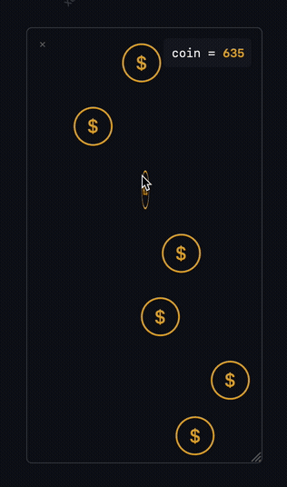

# Coin Coding

**English** | [中文](#中文)


---

## What are you doing while your AI is working?

At home, I'm probably scrolling TikTok. At the office, I'm probably just staring at the screen.

So I built a minimal little game to fill the time — **Coin Coding**.

Coin Coding is a macOS menu bar app that syncs in real time with your AI agent's working state. While your agent runs, coins rain down from a floating window. Click to collect them.

Beyond killing time, Coin Coding keeps you passively aware of what your agent is doing — no matter which window you're in.

Tokens burning, coins dropping. Good luck. 🪙

Supports **Claude Code** and **Trae**.



---

## Features

- Real-time sync with your agent's working state
- Minimal coin-catching game
- Transparent floating window — drag anywhere, resize freely
- Custom coin art (Coinface) and click sound presets
- Global leaderboard — coming soon

---

## Install

Requires **macOS**. Windows is not supported.

### Claude Code

```bash
curl -fsSL https://raw.githubusercontent.com/xueyan1024-bot/coin-coding/main/install.sh | bash
```

This will:
- Download and install the app to `/Applications`
- Wire up hooks so the app knows when your agent is active
- Set the app to launch at login

After install, look for the `$` icon in your menu bar. No further configuration needed.

> **Note:** Coin Coding cannot detect when Claude Code is waiting for a permission prompt. The game keeps running in those moments.

### Trae

```bash
curl -fsSL https://raw.githubusercontent.com/xueyan1024-bot/coin-coding/main/install.sh | bash
```

This will:
- Download and install the app to `/Applications`
- Write hooks into Trae's global config so the app knows when your agent is active
- Set the app to launch at login

After install, go to Trae **Settings → Hooks**, find **已配置的 Hooks**, and make sure it is enabled and set to **本地自动运行 (Run locally)**.

Then look for the `$` icon in your menu bar.

---

## Uninstall

### Claude Code

```bash
rm -rf '/Applications/Coin Coding.app' ~/.coincoding ~/Library/LaunchAgents/com.coincoding.app.plist
```

Then remove the hooks block from `~/.claude/settings.json`.

### Trae

```bash
rm -rf '/Applications/Coin Coding.app' ~/.coincoding ~/Library/LaunchAgents/com.coincoding.app.plist
```

Then go to Trae **Settings → Hooks** and turn off **导入 CLAUDE 中的 Hooks 配置**.

---
---

# 中文


## 当 AI 工作的时候你在做什么？

如果在家，我可能在刷抖音；如果在公司，我可能在盯着他发呆。

所以我做了一款可以消磨 token 消耗时间的极简小游戏 —— **Coin Coding**。

Coin Coding 是一个 macOS 菜单栏应用，和 AI Agent 的工作状态实时同步。Agent 干活时，金币会从一个悬浮小窗口的顶部持续落下。点击收集金币。

Coin Coding 不仅可以消磨时间，还可以让你在任何窗口都能对 Agent 的工作状态保持一种轻度感知。

token 在跑，金币在爆，祝您发财！🪙

支持 **Claude Code** 和 **Trae**。


---

## 功能特性

- 实时感知 Agent 工作状态
- 极简集金币小游戏
- 透明背景，随意拖动，随意更改窗口大小
- 自定义金币图案（Coinface）和点击音效
- 全球排行榜 — 即将上线

---

## 安装

需要 **macOS**，暂不支持 Windows。

### Claude Code

```bash
curl -fsSL https://raw.githubusercontent.com/xueyan1024-bot/coin-coding/main/install.sh | bash
```

安装脚本会自动完成：
- 下载并安装 app 到 `/Applications`
- 配置 hooks，让 app 感知 Agent 状态
- 设置开机自启

安装完成后，菜单栏会出现 `$` 图标，无需任何额外配置。

> **注意：** Coin Coding 暂时无法检测 Claude Code 等待 Permission prompt 的状态，出现确认弹窗时游戏会继续运行。

### Trae

```bash
curl -fsSL https://raw.githubusercontent.com/xueyan1024-bot/coin-coding/main/install.sh | bash
```

安装脚本会自动完成：
- 下载并安装 app 到 `/Applications`
- 写入 Trae 全局 hooks 配置，让 app 感知 Agent 状态
- 设置开机自启

安装完成后，进入 Trae **设置 → Hooks**，找到 **已配置的 Hooks**，确认已启用且运行方式为 **本地自动运行**。

之后菜单栏会出现 `$` 图标。

---

## 卸载

### Claude Code

```bash
rm -rf '/Applications/Coin Coding.app' ~/.coincoding ~/Library/LaunchAgents/com.coincoding.app.plist
```

然后手动从 `~/.claude/settings.json` 里删掉 hooks 相关配置。

### Trae

```bash
rm -rf '/Applications/Coin Coding.app' ~/.coincoding ~/Library/LaunchAgents/com.coincoding.app.plist
```

然后在 Trae **设置 → Hooks** 里关闭 **导入 CLAUDE 中的 Hooks 配置**。
